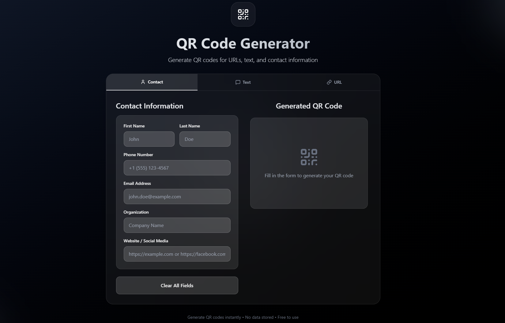

# QR Code Generator

A modern web application to generate QR codes for URLs, text, and contact information.  
Built with **React + Vite**, styled with **Tailwind CSS**, and supports **multilingual (EN/VI)** interface.  




## ✨ Features

- Generate QR codes for:
  - Website URLs (e.g., https://example.com/, https://facebook.com/username, https://instagram.com/username)
  - Plain text
  - Contact information (vCard format)
- **Download** or **copy QR code data** easily
- Clean and modern **UI/UX**
- **Internationalization (i18n)**: English 🇺🇸 & Vietnamese 🇻🇳
- Responsive design, optimized for desktop & mobile


## 🛠️ Tech Stack

- **Frontend**: [React](https://reactjs.org/), [Vite](https://vitejs.dev/)
- **Styling**: [Tailwind CSS](https://tailwindcss.com/)
- **UI Components**: [shadcn/ui](https://ui.shadcn.com/), [lucide-react](https://lucide.dev/)
- **QR Code Engine**: [qrcode](https://github.com/soldair/node-qrcode)
- **Internationalization**: Custom JSON-based translation system


## 📦 Installation

Clone the repo and install dependencies:

```bash
git clone https://github.com/LuuAnhDung/qr-code-generator.git
cd qr-code-generator
npm install
```

Run development server:

```bash
npm run dev
```

Build for production:

```bash
npm run build
```

Preview production build:

```bash
npm run preview
```


## 🌐 Internationalization
- Default locale: **English (en-US)**

- Supported locales:
  - English (en-US)
  - Vietnamese (vi-VN)

You can toggle the language in the app footer.


## 🤝 Contributing

Contributions, issues, and feature requests are welcome!


## 📬 Contact

- **Facebook**: facebook.com/lladungg

- **Email**: luuanhdung0203@gmail.com
